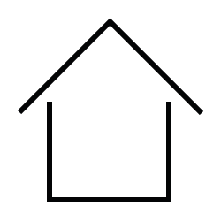

<!DOCTYPE html>
<html xmlns="http://www.w3.org/1999/xhtml" xml:lang="de-de" lang="de-de" dir="ltr">

<head>
    <meta http-equiv="Content-Type" content="text/html; charset=utf-8"/>
    <meta name="viewport" content="width=device-width, initial-scale=1.0, maximum-scale=3.0, user-scalable=yes"/>
    <title>Icons Angie Radtke 2019</title>

    
</head>

<body>

    <h1>Joomla 4 Beez SVGs   by Angie </h1>
    
     
      
     
    

    

        <small>© Angie Radtke 2019</small>
    

</body>
</html>
